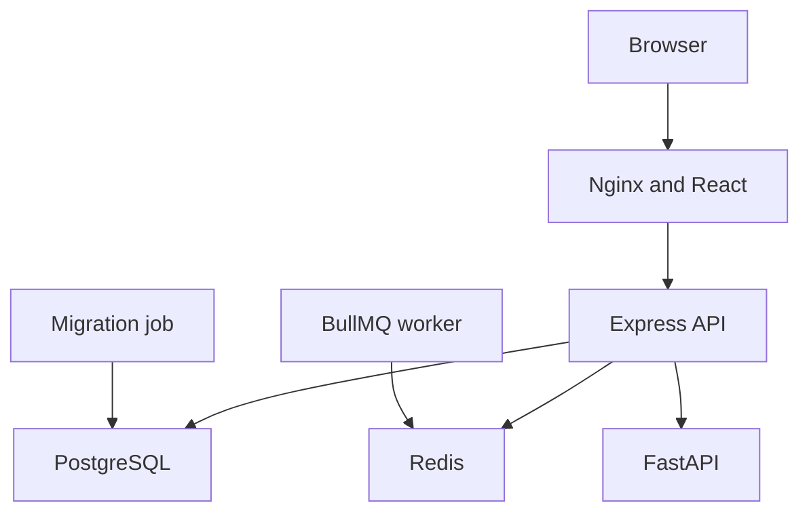

# Foundation architecture

The browser loads the React build from Nginx. Nginx proxies `/api` to Express,
keeping browser requests same-origin. The API checks PostgreSQL through Prisma,
Redis directly, the worker's expiring heartbeat, and FastAPI over HTTP.
BullMQ runs in a separate worker process using Redis. The current queue accepts
diagnostic jobs only. No public route can enqueue jobs in this milestone.

## Health semantics

- `/api/health`: process liveness only; dependency failures do not make it fail.
- `/api/ready`: 200 only if all four dependency checks pass; otherwise 503.
- The database check reads the milestone marker created by the migration, so
  a reachable but unmigrated database does not count as ready.
- Each probe has a response deadline. The database driver, Redis client and
  HTTP request also have their own timeouts.
- The worker heartbeat expires after 15 seconds; it is an availability signal,
  not evidence that imports work. The smoke command verifies actual execution.
- `/health` on FastAPI explicitly reports `summaries_enabled: false`.

## Data and security boundaries

The only application table is `SystemMetadata`, a harmless migration marker.
Financial schema and authentication are deliberately deferred to the next
milestones so unresolved rules are not silently encoded. No user data is seeded.
Database and Redis are reachable only inside the Compose network. The default
password is for local demonstration only; it is not a production secret.

## Dependencies

JavaScript direct dependencies are pinned and `package-lock.json` locks the
resolved tree. Prisma CLI, client and PostgreSQL adapter use the same version.
Python dependencies are recorded in `requirements.txt`; regenerate that file
when deliberately updating `requirements.in`.
Docker images use explicit major-series tags rather than immutable digests;
they can receive updates. CI and local checks must run after rebuilding.

OpenAI calls, model selection, authentication, hosting providers, refund rules,
and reconciliation precedence are not decided by this scaffold.
